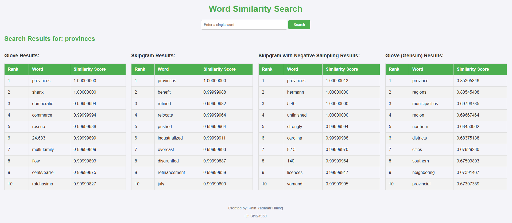
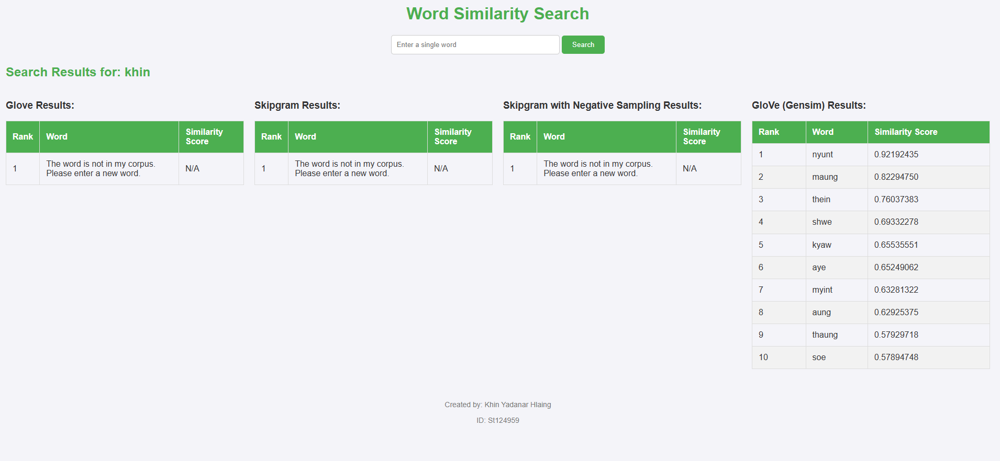

# NLP_A1_That’s What I LIKE

## Student Information
Name - Khin Yadanar Hlaing 
ID - st124959


To run app, 
1. Load the files from this repository
2. Run
```sh
python app.py
```
3. Access the app with http://127.0.0.1:5000 

**When you run python app.py,Download glove.6B.100d.txt from the GloVe website, run python app.py, and follow the instructions to place the file in the specified directory. b/c file size of glove.6B.100d.txt is large.**

## Usage
Enter a single word on a search bar and display the top 10 most similar words from each model's vocabulary.

## Training Data
Corpus source - nltk datasets('reuters')
Token Count |C| - 241109  
Vocabulary Size |V| - 14270
Embedding dimension - 2  
Learning rate - 0.001  
Epochs - 1000  

Training parameters are consistant across all three models.  

## Model Comparison

| Model             | Window Size | Training Loss | Training Time | Syntactic Accuracy | Semantic Accuracy |
|-------------------|-------------|---------------|---------------|--------------------|-------------------|
| Skipgram          | 2     | 9.68      | 9 min 42 sec       | 0.00%            | 0.00%           |
| Skipgram (NEG)    | 2     | 3.11       | 10 min 30 sec       | 0.00%            | 0.00%           |
| Glove             | 2     | 0.42       | 2 min 27 sec       | 0.00%            | 0.00%           |
| Glove (Gensim)    | -     | -       | -       | 55.45%            | 93.87%           |

## Similarity Scores

| Model               | Skipgram | Skipgram (NEG) | GloVe | GloVe (Gensim) | Y true |
|---------------------|-----------|----------------|-------|----------------|--------|
| **Spearman Correlation**             | 0.192   | 0.128        | 0.26 | 0.6035        | 0.8735 |


## Model Comparison Report
This report evaluates the performance of four word embedding models: Skipgram, Skipgram with Negative Sampling (NEG), GloVe, and GloVe (Gensim). The training loss for Skipgram, Skipgram (NEG), and GloVe has improved due to enhancements in the calculation functions. While the training times for both Skipgram models are similar, GloVe is notably faster. However, the semantic and syntactic accuracy of all three models trained from scratch is 0%, likely due to limitations in the corpus size. In similarity tests, the pretrained GloVe (Gensim) model performs close to human-level judgment, with a Spearman correlation of 0.6035, significantly outperforming the other models. This highlights the importance of pretraining and larger datasets for achieving higher accuracy and similarity performance. Overall, GloVe (Gensim) stands out as the most effective model, while the from-scratch models require further optimization or larger datasets to improve their results.

 Fig1

 Fig2

 From Fig. 2, which evaluates the performance on Myanmar names "khin", it is evident that the GloVe model implemented in Gensim effectively captures the semantic similarity between Myanmar name words.


