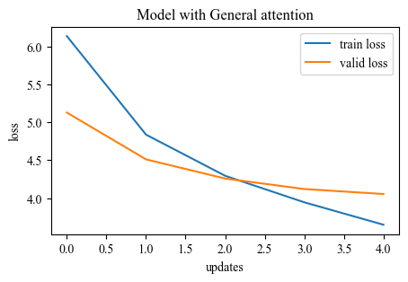
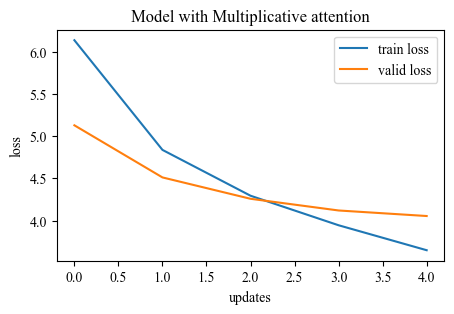
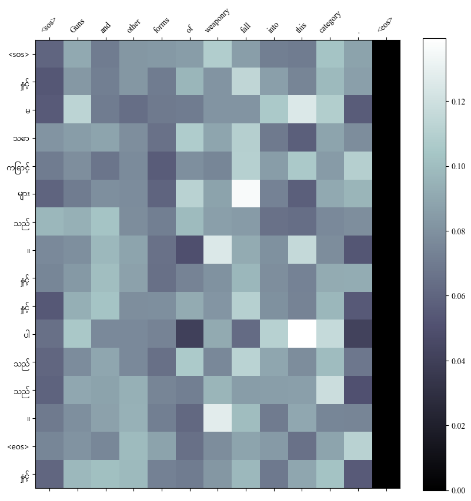
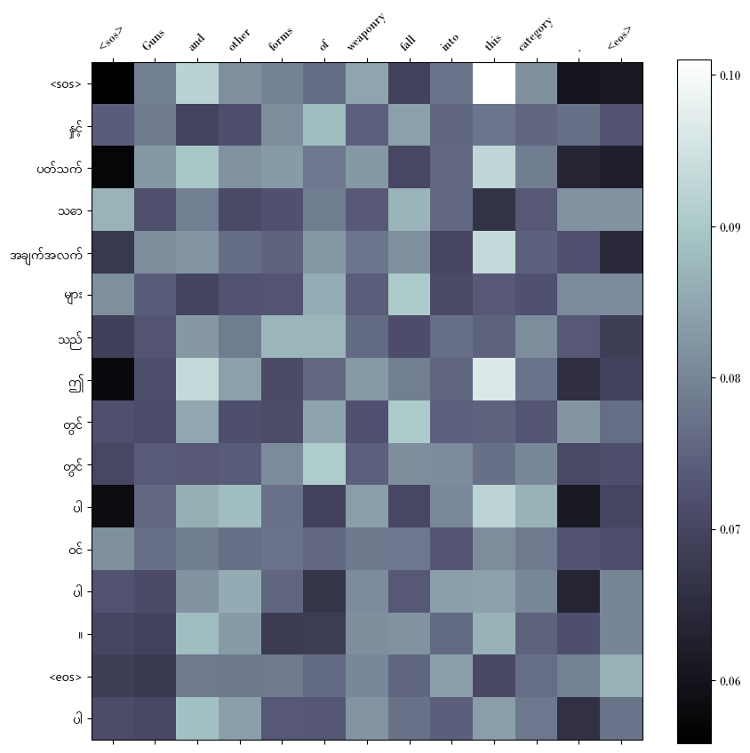
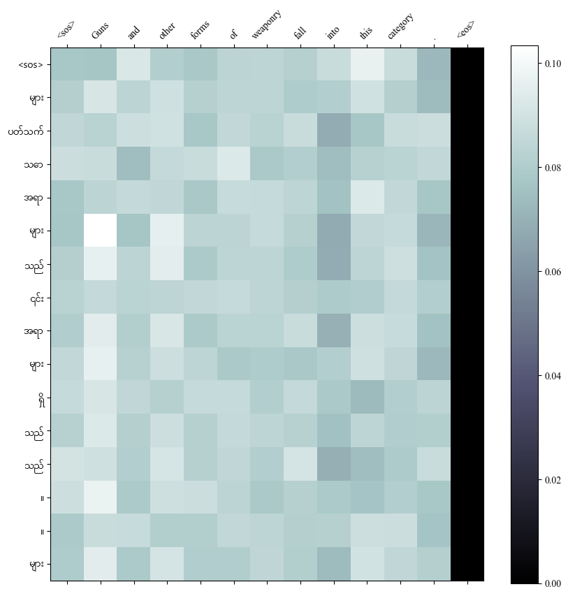
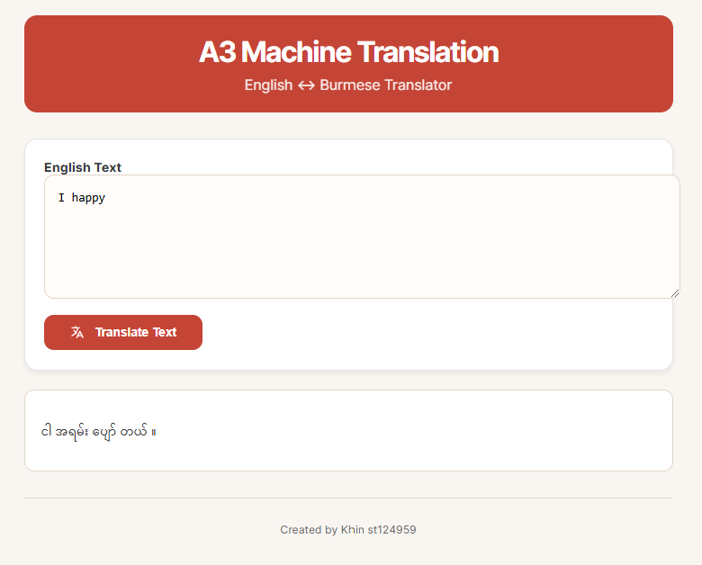
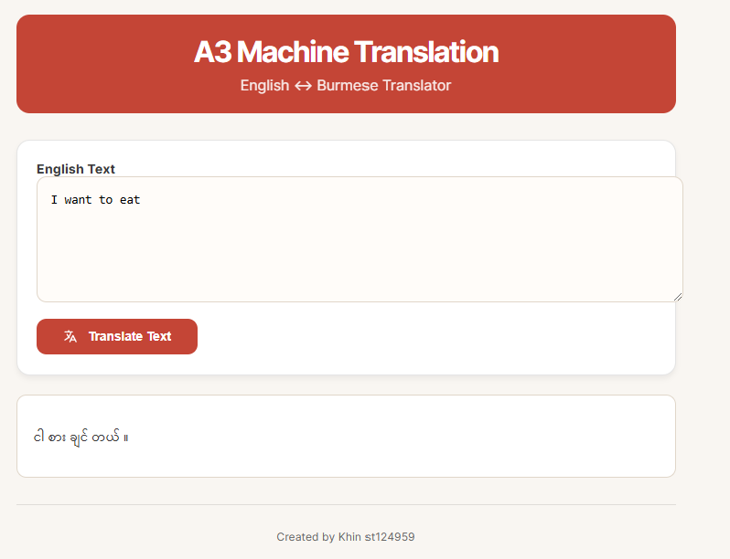

# A3_Machine_Translation_Language

- [Student Information](#student-information)
- [Task 1 - Get Language Pair](#task-1---get-language-pair)
   - [Dataset](#dataset)
   - [Preprocessing](#preprocessing)
   - [Tokenizing](#tokenizing)
- [Task 2 - Experiment with Attention Mechanisms](#task-2---experiment-with-attention-mechanisms)
- [Task 3 - Evaluation and Verification](#task-3---evaluation-and-verification)
   - [Performance Plots](#performance-plots)
   - [Attention Maps](#attention-maps)
   - [Result Discussion](#result-discussion)
- [Task 4 - Web Application](#task-4---web-application)
    - [How to run](#how-to-run)
    - [Result](#result)
 

## Student Information
 - Name: Khin Yadanar Hlaing
 - ID: st124959


## Task 1 - Get Language Pair

### Dataset
- Source:https://github.com/akhtet/myXNLI/tree/main
- Merging multiple text files, cleaning unnecessary characters such as numbers, ratings, and symbols, and then separating English and Myanmar sentences.
- split into training, validation, and test sets
- upload to Hugging Face khinhlaing/myn-eng-dataset

### Preprocessing
The dataset preprocessing involved merging multiple text files, cleaning unnecessary characters such as numbers, ratings, and symbols, and then separating English and Myanmar sentences. Afterward, the cleaned text was structured into a parallel dataset, saved as a CSV file, and split into training, validation, and test sets. Finally, the dataset was uploaded to Hugging Face for accessibility and further use. The preprocessing approach was inspired by the methods from the myXNLI project on GitHub (https://github.com/akhtet/myXNLI/tree/main).

### Tokenizing
English(source language) - tokenized using torch get_tokenizer.

Burmese/Myanmar (target language) - tokenized using Dr.Ye Kyaw Thu's myWord segmenter (https://github.com/ye-kyaw-thu/myWord)

For tokenization, the English (source) text is processed using PyTorch’s get_tokenizer, while the Burmese (target) text is segmented using Dr. Ye Kyaw Thu's myWord segmenter. Since Burmese lacks meaningful spaces, a regular expression is applied to first break sentences into syllables. These syllables are then grouped into meaningful word units, ensuring proper segmentation.


Sentence: still wear dresses when I'm working at home because I feel fancier.


Sentence:  အိမ်မှာ အလုပ်လုပ်ရင်လည်း အင်္ကျီလဲဖြစ်တယ် ပိုပြီးတော့ အာရုံလာလို့လေ။
Tokenization:  ['အိမ်', 'မှာ', 'အလုပ်', 'လုပ်', 'ရင်', 'လည်း', 'အင်္ကျီ', 'လဲ', 'ဖြစ်', 'တယ်', 'ပို', 'ပြီး', 'တော့', 'အာရုံ', 'လာ', 'လို့', 'လေ', '။']


Once tokenized, a vocabulary is built by selecting tokens that appear at least twice. The processed corpus is then transformed into tensors, with padding applied using a collation function. This prepares the data for efficient batch loading during model training.
## Task 2 - Experiment with Attention Mechanisms


| Attentions       | Training Loss | Training PPL | Validation Loss | Validation PPL |
|------------------|---------------|--------------|-----------------|----------------|
| General       |        3.488         |       32.706       |      3.829         |        46.007         |
| Multiplicative|         3.654        |       38.622        |       4.036        |         56.573        |
| Additive      |        3.648           |      38.379        |       4.053         |          47.583      |

The performance of the additive attention mechanism is slightly better than the performance of the other two mechanisms. The reasoning and implication behind this will be explained in [Relation between Burmese and Additive Attention](#relation-between-burmese-and-additive-attention).

The computational efficiency :  
General Attention : 14m 4s  
Multiplicative Attention : 7m 11s  
Additive Attention : 10m 19s  


The translation accuracy, however, is lacking for all three mechanisms. Since there is no clear benchmark available for Myanmar language, the additive attention mechanism was chosen based purely on validation loss and perplexity.

## Loss Graph
| General Attention Loss                                     | Multiplicative Attention Loss                                      | Additive Attention Loss                                       |
|----------------------------------------------|----------------------------------------------|----------------------------------------------|
|  |  |  |
 

## Attention Map
| General Attention Map                                     | Multiplicative Attention Map                                      | Additive Attention Map                                       |
|----------------------------------------------|----------------------------------------------|----------------------------------------------|
|  |  |  | 

## Relation between Burmese and Additive Attention
The complexity of relationships between the tokens in the Burmese language as well as the cross relations between each Burmese phrase and English word is assumed to be the primary reason behind the slight performance advantage of the additive attention model over the other two models. The extra trainable hyperparameters of the additive attention mechanism allows for these complex relationships to be learned by the model.

## Web application and model interface
The web application loads the model and pass the user input as source. The greedy decode takes that user input, sets the targets as `<sos>` token and starts predicting the next word. The next word is then appended to the target list and the process repeats until the max length is reached or an `<eos>` token is predicted. The targets are then joined and displayed back to the user as translated text.


### Result Discussion

- **Validation Scores**: 
  - The **Additive Attention** mechanism yields the lowest validation loss and perplexity, indicating better performance compared to the other mechanisms.
  - The **Multiplicative Attention** mechanism performs slightly worse than additive, while the **General Attention** mechanism performs the poorest.

- **Training Scores**:
  - The **Additive Attention** mechanism achieves the lowest training loss, indicating efficient learning during training.
  - The **General Attention** mechanism has a slightly higher training loss compared to the multiplicative mechanism.

#### Overall Effectiveness:

- The **Additive Attention** mechanism demonstrates superior performance in both training and validation metrics, making it the most effective choice for translating between the native language and English.
- The **Multiplicative Attention** mechanism performs reasonably well but falls short compared to the additive mechanism.
- The **General Attention** mechanism lags behind the others, suggesting it may not be as effective in capturing relevant information for translation.

#### Conclusion:

Based on the evaluation using validation perplexity and loss, along with consideration of training scores, the **Additive Attention** mechanism proves to be the most effective choice for translating between the native language and English.


## Task 4 - Web Application

### How to Run
1. **Install Dependencies:** Ensure you have the required libraries installed, including `torch`, `torchtext`, `nltk`, and `requests`.
2. **Run the Notebook:** Open the `MT+Transformers` notebook and run the cells to preprocess the data, train the model, and generate text.
3. To run app, 

 - Load the files from this repository

 - Run

```sh
python app.py
```
 - Access the app with http://127.0.0.1:5000 

### Result



