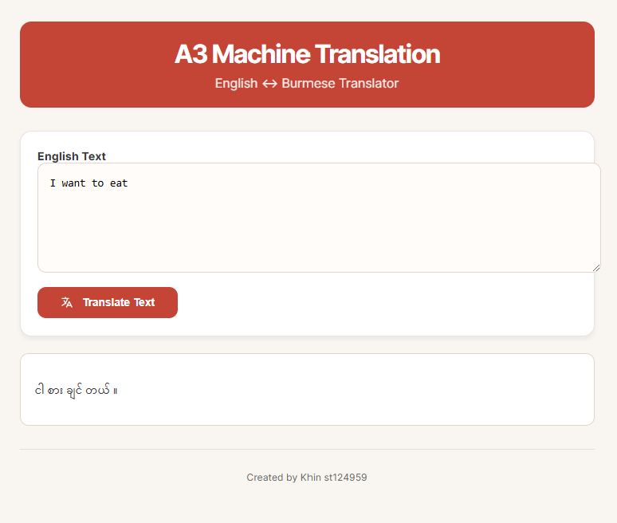

# A3_Machine_Translation_Language

- [Student Information](#student-information)
- [Task 1 - Get Language Pair](#task-1---get-language-pair)
   - [Dataset](#dataset)
   - [Preprocessing](#preprocessing)
   - [Tokenizing](#tokenizing)
- [Task 2 - Experiment with Attention Mechanisms](#task-2---experiment-with-attention-mechanisms)
- [Task 3 - Evaluation and Verification](#task-3---evaluation-and-verification)
   - [Performance Plots](#performance-plots)
   - [Attention Maps](#attention-maps)
  
- [Task 4 - Web Application](#task-4---web-application)
    - [How to run](#how-to-run)
    - [Result](#result)
 

## Student Information
 - Name: Khin Yadanar Hlaing
 - ID: st124959


## Task 1 - Get Language Pair

### Dataset
- Source:https://github.com/akhtet/myXNLI/tree/main
- Merging multiple text files, cleaning unnecessary characters such as numbers, ratings, and symbols, and then separating English and Myanmar sentences.
- split into training, validation, and test sets
- upload to Hugging Face khinhlaing/myn-eng-dataset

### Preprocessing
The dataset preprocessing involved merging multiple text files, cleaning unnecessary characters such as numbers, ratings, and symbols, and then separating English and Myanmar sentences. Afterward, the cleaned text was structured into a parallel dataset, saved as a CSV file, and split into training, validation, and test sets. Finally, the dataset was uploaded to Hugging Face for accessibility and further use. The preprocessing approach was inspired by the methods from the myXNLI project on GitHub (https://github.com/akhtet/myXNLI/tree/main).

### Tokenizing
English(source language) - tokenized using torch get_tokenizer.

Burmese/Myanmar (target language) - tokenized using Dr.Ye Kyaw Thu's myWord segmenter (https://github.com/ye-kyaw-thu/myWord)

For tokenization, the English (source) text is processed using PyTorch’s get_tokenizer, while the Burmese (target) text is segmented using Dr. Ye Kyaw Thu's myWord segmenter. Since Burmese lacks meaningful spaces, a regular expression is applied to first break sentences into syllables. These syllables are then grouped into meaningful word units, ensuring proper segmentation.


Sentence: still wear dresses when I'm working at home because I feel fancier.


Sentence:  အိမ်မှာ အလုပ်လုပ်ရင်လည်း အင်္ကျီလဲဖြစ်တယ် ပိုပြီးတော့ အာရုံလာလို့လေ။
Tokenization:  ['အိမ်', 'မှာ', 'အလုပ်', 'လုပ်', 'ရင်', 'လည်း', 'အင်္ကျီ', 'လဲ', 'ဖြစ်', 'တယ်', 'ပို', 'ပြီး', 'တော့', 'အာရုံ', 'လာ', 'လို့', 'လေ', '။']


Once tokenized, a vocabulary is built by selecting tokens that appear at least twice. The processed corpus is then transformed into tensors, with padding applied using a collation function. This prepares the data for efficient batch loading during model training.
## Task 2 - Experiment with Attention Mechanisms

Epochs - 5
Batch Size- 125
Hidden dimension - 256
Feedforward dimension - 512
Number of encoder/decoder layers - 3
Number of heads for multihead attention - 8
Dropout rate - 0.1


| Attentions       | Training Loss | Training PPL | Validation Loss | Validation PPL |
|------------------|---------------|--------------|-----------------|----------------|
| General       |        3.488         |       32.706       |      3.829         |        46.007         |
| Multiplicative|         3.654        |       38.622        |       4.036        |         56.573        |
| Additive      |        3.648           |      38.379        |       4.053         |          47.583      |


The computational efficiency :  
General Attention : 14m 4s  
Multiplicative Attention : 7m 11s  
Additive Attention : 10m 19s  

Training and validation losses are nearly the same across all attention mechanisms. While General Attention performs slightly better, it is the slowest (14m 4s). Multiplicative Attention is the fastest (7m 11s) but has the highest perplexity. Additive Attention (10m 19s) offers a good balance between performance and efficiency, making it the best choice for Myanmar translation.

## Task 3 - Evaluation and Verification

| General Attention Loss                                     | Multiplicative Attention Loss                                      | Additive Attention Loss                                       |
|----------------------------------------------|----------------------------------------------|----------------------------------------------|
|  |  |  |
 

## Attention Map
| General Attention Map                                     | Multiplicative Attention Map                                      | Additive Attention Map                                       |
|----------------------------------------------|----------------------------------------------|----------------------------------------------|
|  |  |  | 


## Task 4 - Web Application

### How to Run
1. **Install Dependencies:** Ensure you have the required libraries installed, including `torch`, `torchtext`, `nltk`, and `requests`.
2. **Run the Notebook:** Open the `MT+Transformers` notebook and run the cells to preprocess the data, train the model, and generate text.
3. To run app, 

 - Load the files from this repository

 - Run

```sh
python app.py
```
 - Access the app with http://127.0.0.1:5000 

### Result



