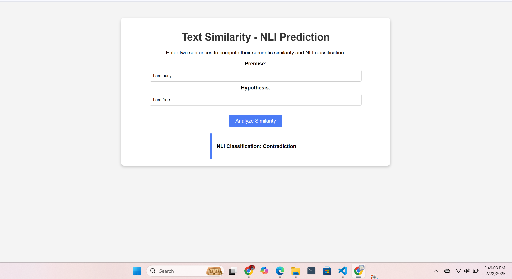
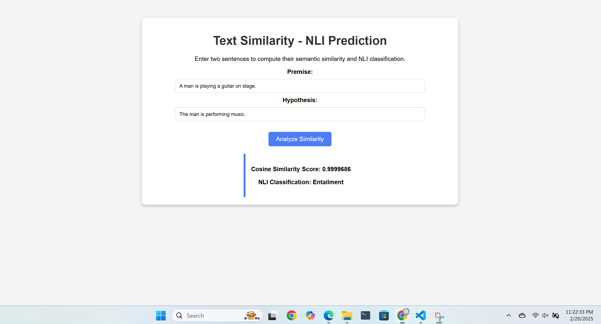

#  A4: Do you AGREE?

- [Student Information](#student-information)
- [Installation and Setup](#installation-steps)
- [Task 1 - Training BERT from Scratch](#task-1---training-bert-from-scratch)
- [Task 2 - Sentence BERT](#task-2---sentence-bert)
- [Task 3 - Evaluation and Analysis](#task-3---evaluation-and-analysis)
- [Task 4 - Web Application](#task-4---web-application)
    - [Web Page Result](#web-page-result)
    - [Usage](#usage)

## Student Information
 - Name: Khin Yadanar Hlaing
 - ID: st124959

## Installation Steps
To run app, 
1. Load the files from this repository
2. Run
```sh
python app.py
```
3. Access the app with http://127.0.0.1:5000 

## Task 1 - Training BERT from Scratch
### Introduction
    This report evaluates the implementation of a Siamese-BERT (S-BERT) model for Natural Language 
Inference (NLI) classification using the MNLI dataset. The primary objective wasto compare the performance of an S-BERT model trained on a custom BERT variant against a pre-trained S-BERT model.


- Dataset: [BookCorpus](https://huggingface.co/datasets/bookcorpus/bookcorpus) 
- The hyperparameters chosen for training our BERT model was:  
    - Number of Encoder of Encoder Layer - 6  
    - Number of heads in Multi-Head Attention - 8  
    - Embedding Size/ Hidden Dim - 768  
    - Number of epochs - 1000  
    - Training data - 740042 sentences
    - dimension of K(=Q), V  =64
    - Vocab size - 60305  
- Save Model: Then, I save model weights which can be located in the `app/models/bert-from-scratch.pt`


## Task 2 - Sentence BERT

- Dataset: [MNLI](https://huggingface.co/datasets/glue/viewer/mnli)
- The hyperparameters chosen for tuning S-BERT on pretrained  BERT model was:
    - Training data - 10000 rows  
    - Number of epochs - 2 
- The hyperparameters chosen for tuning S-BERT on our BERT model was:
    - Training data - 10000 rows  
    - Number of epochs - 5  

Model Variants

S-BERT on our BERT model: A custom-trained S-BERT variant based on a modified BERT architecture.

S-BERT (Pre-trained): A pre-trained S-BERT model for comparison.


## Task 3 - Evaluation and Analysis

| Model Type | trainable parameter | Average Cosine Similarity | Average Loss | Cosine Similarity with one specific pair sentence  | Accuracy| Precision | Recall,F1-score | Training Time (train with MNLI dataset)
|:--------------------------------|:----------:|:----------:|:----------:|:----------:|:----------:|:----------:|:----------:|:---------------------:|
| S-BERT on our BERT model        |    83,137,171   |    0.9986     |  8.9522 | 0.9996 |  0.3190| 0.1018 | 0.3190,0.1543|  564m 2s(on CPU)    |
| S-BERT(Pre)           |   109,482,240    |    0.7733 |  1.0790 | 0.8057 | 0.3410 | - | - | 139m 54s(num-epoch=2)       |  

### Lmitations or challenges
1. High Training Time Without GPU

- Training on a large dataset like MNLI without GPU led to excessive training time (~9 hours on CPU).

2. Matrix Shape Mismatches

- The need to align tokenization and model input shapes for both BERT and S-BERT posed challenges.

- Token embeddings had mismatched sequence lengths (e.g., token embeddings of shape [1, 5, 60305] while attention masks had shape [1, 200]).

- Custom mean_pool function had to be adjusted to match attention masks with embeddings.

3. Low Accuracy and Precision

- The accuracy of 0.3190 for the custom S-BERT model and 0.3410 for the pre-trained model indicates room for improvement.

- The precision of 0.1018 suggests that the model struggles to correctly classify entailment, contradiction, and neutral relations.

### Proposed Improvements

   To improve the efficiency and performance of the BERT-Siamese model, several optimizations were 
implemented. Training with mixed precision (FP16) on a GPU significantly reduced both memory usage and training time. Tokenization and padding strategies were adjusted to better align with the model’s input requirements, ensuring consistency across batches. To enhance generalization, the model was trained on a larger and more diverse dataset. Additionally, reducing the hidden size helped optimize computational efficiency without compromising performance. Finally, different BERT variants, including RoBERTa and ALBERT, were tested to explore potential improvements. These adjustments collectively aimed to refine the model’s accuracy and efficiency.

## Task 4 - Web Application

### Web Page Result



### Usage:
- Input: There are two input fields where you can enter two sentences to compare.
- Output: after you click the 'Analyze Similarity' button, the NLI Classification can be seen.