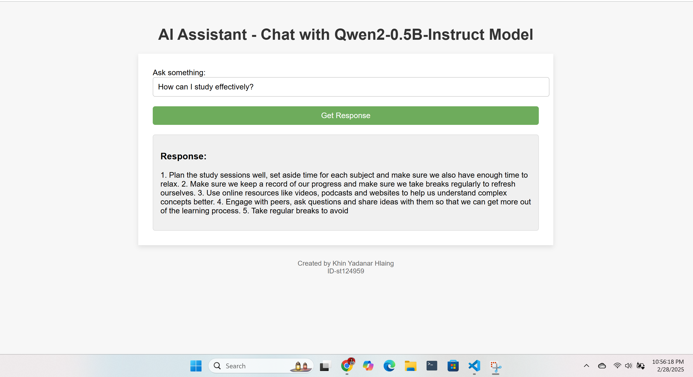
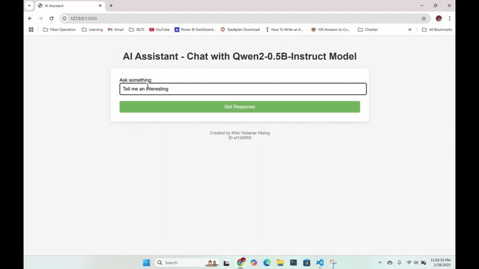

# A5: Optimization of Human Preferences

## Project Details

- **Name:** Khin Yadanar Hlaing  
- **ID:** st124959  

This project implements **Direct Preference Optimization (DPO)** to enhance a pre-trained language model’s responses based on human preferences. Using **Hugging Face’s TRL library**, the process is divided into four key tasks:

1. **Data Preparation**  
2. **Model Fine-Tuning using DPOTrainer**  
3. **Saving & Uploading Model to Hugging Face Hub**  
4. **Developing a Web Application for Inference**  

## Project Overview

The goal is to align the **Qwen2-0.5B-Instruct** model with human preferences by fine-tuning it on a structured dataset, saving the trained model, and deploying an interactive web application for inference. The project is optimized for GPU performance with efficient memory management and hyperparameter tuning.

---

## Task 1: Data Preparation

### Dataset
The publicly available [Dahoas/static-hh](https://huggingface.co/datasets/Dahoas/static-hh) dataset is used, containing fields such as `prompt`, `chosen`, and `rejected`. The dataset is preprocessed to ensure that each example is structured correctly for training.

### Key Steps:
- Extract and clean **prompt** and **response** fields.
- Subset data for initial testing and debugging.

---

## Task 2: Fine-Tuning with DPOTrainer

### Model & Dataset
- **Pretrained Model:** `Qwen/Qwen2-0.5B-Instruct`
- **Dataset:** Preprocessed version of `Dahoas/rm-static`

### Training Configuration

| Parameter | Value |
|-----------|------|
| **Batch Size** | 1 (micro-batch) |
| **Gradient Accumulation** | 4 |
| **Epochs** | 3 |
| **Learning Rate** | 5e-5 |
| **Beta** | 0.1 |

### Training Process
1. **Model Initialization** - Load the base and reference models, move them to GPU.
2. **Configuration Setup** - Define `DPOConfig` with training parameters.
3. **Fine-Tuning** - Compute **DPO loss**, update model weights, and log progress.
4. **Hyperparameter Tuning** *(optional)* - Test variations of learning rate, batch size, epochs, and beta.


**Experiment Results**- 'learning_rate': 5e-05, 'batch_size': 4, 'epochs': 3, 'beta': 0.1, 'loss': 1.6342010498046875
---

## Task 3: Model Saving & Uploading

After fine-tuning, the model and tokenizer are saved and upload to **Hugging Face Hub**.
 
   **Repository ID Link:** [khinhlaing/dop_qwan](https://huggingface.co/khinhlaing/dop_qwan/tree/main)

This allows easy access for inference and further fine-tuning.

---

## Task 4: Web Application for Inference

#### Screenshots:
- **Result**  
    

- **Video**  



## How to Run the Project

To run app, 
1. Load the files from this repository
2. Run
```sh
python app.py
```
3. Access the app with http://127.0.0.1:5000 
---

## Dependencies
Install all necessary libraries:
```bash
pip install torch transformers datasets trl gradio huggingface_hub pynvml
```

---

