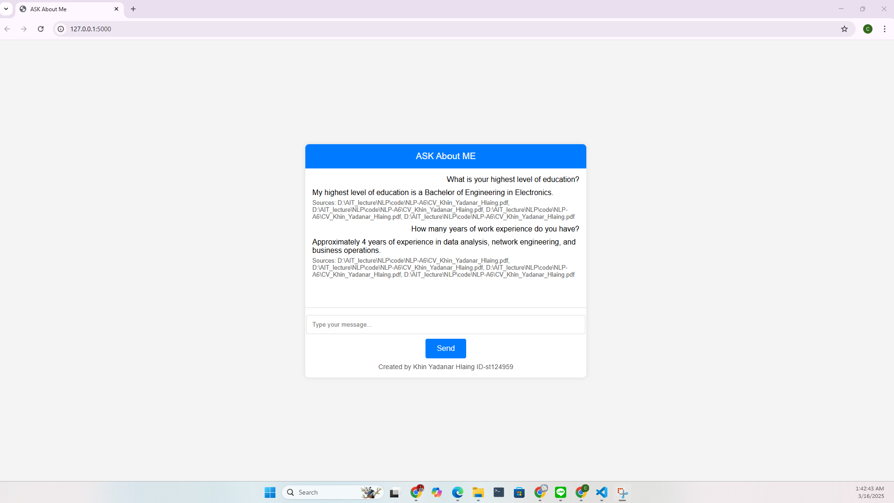

# A6: Let's Talk with Yourself

## Project Details

- **Name:** Khin Yadanar Hlaing  
- **ID:** st124959  

This project implements **Retrieval-Augmented Generation (RAG)** using the **LangChain framework**. The chatbot is designed to answer personal questions based on **documents, resumes, and web data sources**.

The implementation is divided into three key tasks:

1. **Source Discovery (Document & Web Data Integration)**
2. **Analysis and Problem Solving**
3. **Chatbot Development (Web Application)**

---

## Task 1: Source Discovery

### Data Sources
- **Documents:**
  - `CV_Khin_Yadanar_Hlaing.pdf` (Resume)
- **Web Links:**
  - `https://www.linkedin.com/in/kyhlaing/` (LinkedIn Profile)

### Key Steps:
- **Load and Process Documents:** Using `PyMuPDFLoader` to extract text.
- **Web Data Retrieval:** Using `WebBaseLoader` to fetch LinkedIn data.
- **Text Chunking:** Splitting content into manageable sizes (`chunk_size=500`, `chunk_overlap=50`).
- **Embedding Generation:** Using `all-MiniLM-L6-v2` with `FAISS` for efficient search.
- **Retriever Setup:** `FAISS` is used to store and retrieve document embeddings efficiently.

---

## Task 2: Analysis and Problem Solving

### Models Used:

| Component    | Model |
|-------------|---------------------------------|
| **Retriever** | FAISS (`all-MiniLM-L6-v2`) |
| **Generator** | Groq LLaMA-3.1-8B |

### Identified Issues & Solutions:
1. **Web Scraping Limitations:** LinkedIn blocks direct scraping, so an alternative (manual download) was implemented.
2. **Data Irregularities:** Ensured proper preprocessing and text cleaning.
3. **Model Hallucinations:** Improved prompt engineering for accurate answers.
4. **Performance Optimization:** Stored FAISS embeddings locally for faster retrieval.

---

## Task 3: Chatbot Development (Web Application)

A **Flask-based web application** was built to enable interaction with the chatbot.

### Features:
- **Chat Interface:** Users can enter messages in a web-based chatbox.
- **Intelligent Responses:** The model generates personalized responses using `qa_chain`.
- **Source Display:** The chatbot provides links to relevant source documents.

### Screenshots:
- **Chatbot Interface**  
  

---

## How to Run the Project

### **Step 1: Install Dependencies**
```bash
pip install flask langchain langchain-community torch sentence-transformers faiss-cpu
```

### **Step 2: Run the Web Application**
```bash
python app.py
```

### **Step 3: Access the Chatbot**
- Open a browser and go to:  
  **http://127.0.0.1:5000**

---

## Folder Structure
```
A6-TalkWithYourself/
│── app/               # Flask web application
│   ├── app.py         # Backend server
│   ├── templates/
│   │   ├── index.html # Frontend chat UI
│── data/              # Documents & embeddings
│   ├── faiss_index/   # Stored FAISS index for quick retrieval
│   ├── CV_Khin_Yadanar_Hlaing.pdf  # Resume
│── chatbot_responses.json  # Stored chatbot Q&A responses
│── README.md
```

---

## **Example Questions Chatbot Can Answer**
1. How old are you?
2. What is your highest level of education?
3. What major or field of study did you pursue during your education?
4. How many years of work experience do you have?
5. What type of work or industry have you been involved in?
6. Can you describe your current role or job responsibilities?
7. What are your core beliefs regarding the role of technology in shaping society?
8. How do you think cultural values should influence technological advancements?
9. As a master’s student, what is the most challenging aspect of your studies so far?
10. What specific research interests or academic goals do you hope to achieve during your time as a master’s student?

---

## Future Improvements
- **API Integration:** Implement real-time LinkedIn API for dynamic data retrieval.
- **Fine-Tuning:** Train a more personalized model using user-specific datasets.
- **Deployment:** Deploy chatbot as a web service using **Docker & Cloud Services**.

**This project demonstrates how RAG can enhance personal Q&A capabilities!**
