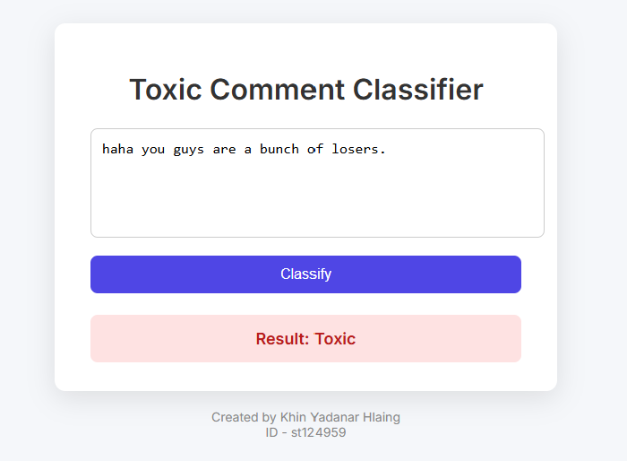
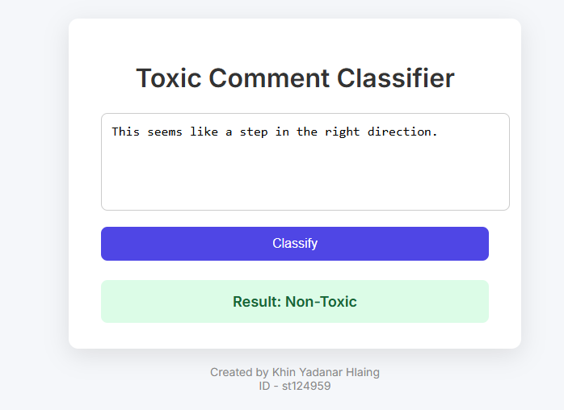

# A7: Training Distillation vs LoRA

##  Student Info
- **Name:** Khin Yadanar Hlaing  
- **ID:** st124959  

---

##  Project Summary

This project explores three methods for fine-tuning BERT models on toxic comment classification using the `google/civil_comments` dataset:

1. **Distillation with Odd-Numbered Layers** (from 12-layer teacher to 6-layer student)
2. **Distillation with Even-Numbered Layers**
3. **LoRA (Low-Rank Adaptation)**

It also includes a web interface that allows users to input a comment and receive a toxicity classification (Toxic / Non-Toxic).

---

## Task 1: Dataset Preparation

- **Dataset:** [google/civil_comments](https://huggingface.co/datasets/google/civil_comments)
- Comments are labeled as **toxic** if `toxicity ≥ 0.6`, and **non-toxic** otherwise.
- 500 samples were randomly selected for lightweight experimentation.
- Dataset was split into:
  - 70% Train
  - 15% Validation
  - 15% Test

---

##  Task 2: Distillation - Odd vs Even Layers

###  Architecture:
- Teacher: `bert-base-uncased` (12 layers)
- Student: 6-layer BERT using copied layers

| Type       | Layers Used (0-based) |
|------------|------------------------|
| Odd        | [0, 2, 4, 6, 8, 10]    |
| Even       | [1, 3, 5, 7, 9, 11]    |

- Both variants were trained for 3 epochs.
- Metrics tracked: training loss, validation loss, and accuracy.

---

##  Task 3: LoRA Fine-Tuning

###  Config
- Base Model: `bert-base-uncased`
- Library: `peft` (Hugging Face)
- Parameters:
  - `r = 8`
  - `alpha = 32`
  - `dropout = 0.05`
  - `target_modules = ["query", "value"]`

This allowed lightweight adaptation by injecting trainable matrices into BERT attention layers.

---

##  Task 4: Evaluation & Analysis

### Final Metrics (Epoch 3)

| Model      | Train Loss | Val Loss | Accuracy |
|------------|------------|----------|----------|
| Odd Layer  | 0.0190     | 0.1981   | 0.9600   |
| Even Layer | 0.0089     | 0.2310   | 0.9600   |
| LoRA       | 0.1752     | 0.1712   | 0.9600   |

 All models achieved the **same accuracy of 96%**, despite differing in training dynamics and loss curves.

---

###  Observations:
- LoRA achieved good performance with a higher training loss, suggesting better generalization.
- Odd/Even student models are stable and effective for this dataset.
- Validation loss differs slightly, but accuracy converges.

###  Challenges:
- Aligning even/odd layer indices with BERT’s 0-based structure.
- LoRA integration with HuggingFace `Trainer` using `peft` adapter.
- Ensuring reproducibility of metrics and visualization consistency.


---

##  Task 5: Toxic Comment Web App

A web interface built with **Flask** allows real-time text classification using the trained `odd_student_model`.

### Features:
- Textbox input for user comments.
- Outputs prediction: **Toxic** or **Non-Toxic**
- Styled UI with clear result highlighting (color-coded).

### Result Web Page





### How to Run

```bash
pip install flask transformers torch
python app.py